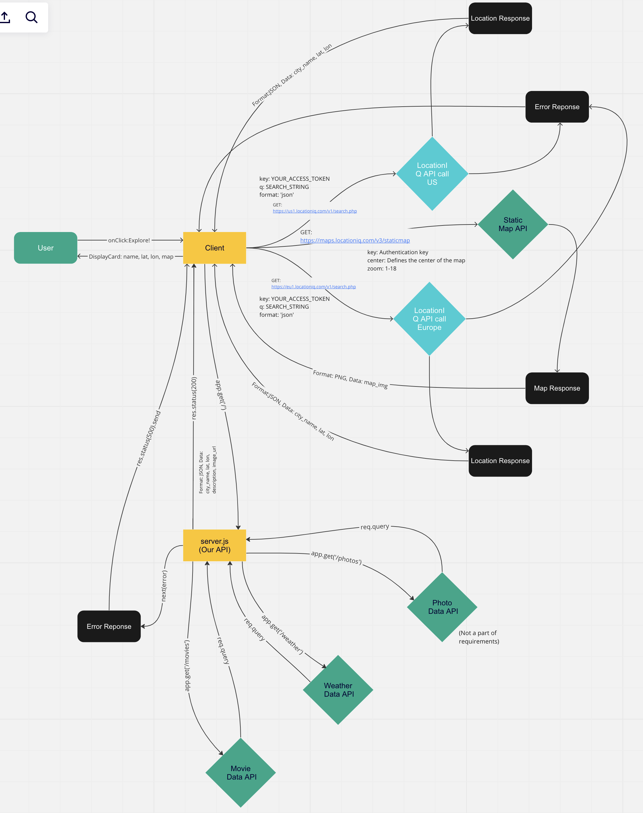
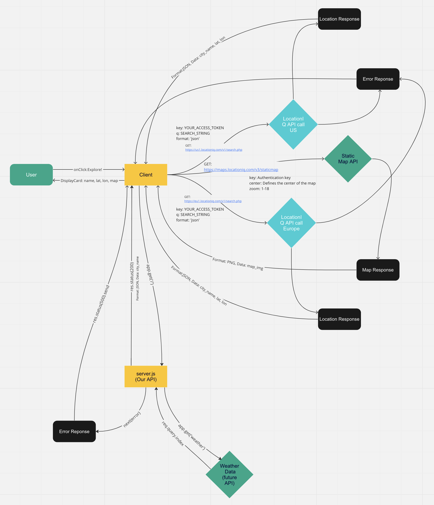

# City Explorer

**Author**: Kyle White

**Version**: 1.4.0

Updated on 4-21-23 added photos of searched city to application.
Updated on 4-20-23 Componetized the front-end codebase. Added CSS styling.
Updated on 4-19-23 included movie component, bootstrap carousel, and link to API server.
Updated on 4-18-23 separated form, alert, and card into separate components.

## Overview

This application is built on the React frontend framework and provides users with a way to explore cities on a global scale from the comfort of their computer. Users can expect to see information about cities, their geolocation, and mapped images displayed once a user provides input.

## Getting Started

1. Create a new React application on your local machine.
2. Create a GitHub repository and clone this project onto your local machine into the new React application folder. 
3. Create a new user account on locationIQ and get your own personal API key.
4. Create a .env file and change the API key using the sample in the .env.sample file
5. Start the application using your favorite code editor!

## Architecture

Built using React, Bootstrap, and axios API handler.

## Change Log

04-21-2023 3:19 Aplication now includes carousel photos for city searched
04-20-2023 3:44 Application is now refactored and componentized 
04-19-2023 3:34 Application is fully setup with a React repository and implementaion of API keys.
04-18-2023 4:16 Application location functionality is working to render location data from the API based on user input.
04-18-2023 5:19 Application map is working to display a PNG image of the user selected city.
04-18-2023 5:42 Application now has a functioning error handler.

## Web Request Response Cycle (with server API)

## Web Request Response Cycle (with server, without API)

## Web Request Response Cycle (without server)

## Time Estimates

### (Version 1.4.0)

Name of feature: Add Photo Component

Estimate of time needed to complete: 30min

Start time: 2:44

Finish time: 3:15

Actual time needed to complete: 31min

###########################################################################

### (Version 1.3.0)

Name of feature: Componetize Front End

Estimate of time needed to complete: 30min

Start time: 3:21

Finish time: 3:44

Actual time needed to complete: 23min

###########################################################################

### (Version 1.2.0)

Name of feature: Setup Frontend Components

Estimate of time needed to complete: 1hr

Start time: 5:05

Finish time: 6:10

Actual time needed to complete: 1hr 5min

###########################################################################

### (Version 1.1.0)

Name of feature: Setup Frontend Components for Server Configuration

Estimate of time needed to complete: 30min

Start time: 6:20

Finish time: 6:56

Actual time needed to complete: 36min

###########################################################################

### (Version 1.0.0)

Name of feature: Setup React Repository & API Keys

Estimate of time needed to complete: 15min

Start time: 3:20

Finish time: 3:34

Actual time needed to complete: 14min

###########################################################################

Name of feature: Locations

Estimate of time needed to complete: 35min

Start time: 3:44

Finish time: 4:16

Actual time needed to complete: 32min

###########################################################################

Name of feature: Map

Estimate of time needed to complete: 40min

Start time: 4:18

Finish time: 5:19

Actual time needed to complete: 61min

###########################################################################

Name of feature: Error Handling

Estimate of time needed to complete: 15min

Start time: 5:20

Finish time: 5:42

Actual time needed to complete: 22min

###########################################################################

## Getting Started with Create React App

This project was bootstrapped with [Create React App](https://github.com/facebook/create-react-app).

## Available Scripts

In the project directory, you can run:

### `npm start`

Runs the app in the development mode.\
Open [http://localhost:3000](http://localhost:3000) to view it in your browser.

The page will reload when you make changes.\
You may also see any lint errors in the console.

### `npm test`

Launches the test runner in the interactive watch mode.\
See the section about [running tests](https://facebook.github.io/create-react-app/docs/running-tests) for more information.

### `npm run build`

Builds the app for production to the `build` folder.\
It correctly bundles React in production mode and optimizes the build for the best performance.

The build is minified and the filenames include the hashes.\
Your app is ready to be deployed!

See the section about [deployment](https://facebook.github.io/create-react-app/docs/deployment) for more information.

### `npm run eject`

**Note: this is a one-way operation. Once you `eject`, you can't go back!**

If you aren't satisfied with the build tool and configuration choices, you can `eject` at any time. This command will remove the single build dependency from your project.

Instead, it will copy all the configuration files and the transitive dependencies (webpack, Babel, ESLint, etc) right into your project so you have full control over them. All of the commands except `eject` will still work, but they will point to the copied scripts so you can tweak them. At this point you're on your own.

You don't have to ever use `eject`. The curated feature set is suitable for small and middle deployments, and you shouldn't feel obligated to use this feature. However we understand that this tool wouldn't be useful if you couldn't customize it when you are ready for it.

## Learn More

You can learn more in the [Create React App documentation](https://facebook.github.io/create-react-app/docs/getting-started).

To learn React, check out the [React documentation](https://reactjs.org/).

### Code Splitting

This section has moved here: [https://facebook.github.io/create-react-app/docs/code-splitting](https://facebook.github.io/create-react-app/docs/code-splitting)

### Analyzing the Bundle Size

This section has moved here: [https://facebook.github.io/create-react-app/docs/analyzing-the-bundle-size](https://facebook.github.io/create-react-app/docs/analyzing-the-bundle-size)

### Making a Progressive Web App

This section has moved here: [https://facebook.github.io/create-react-app/docs/making-a-progressive-web-app](https://facebook.github.io/create-react-app/docs/making-a-progressive-web-app)

### Advanced Configuration

This section has moved here: [https://facebook.github.io/create-react-app/docs/advanced-configuration](https://facebook.github.io/create-react-app/docs/advanced-configuration)

### Deployment

This section has moved here: [https://facebook.github.io/create-react-app/docs/deployment](https://facebook.github.io/create-react-app/docs/deployment)

### `npm run build` fails to minify

This section has moved here: [https://facebook.github.io/create-react-app/docs/troubleshooting#npm-run-build-fails-to-minify](https://facebook.github.io/create-react-app/docs/troubleshooting#npm-run-build-fails-to-minify)
